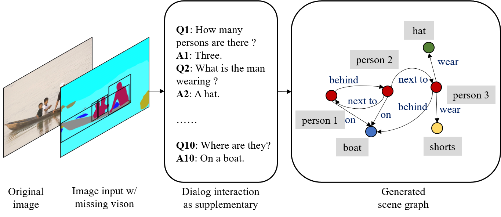

# SI-Dial
This is the Pytorch implementation for the paper [Supplementing Missing Visions via Dialog for Scene Graph Generations]().

## 1. Project Overview
In this work, we aim to explore the Scene Graph Generation (SGG) task under the setting of insufficient visual input, and propose to supplement the missing visions via dialog.

Our implementations are based on this [codebase](https://github.com/KaihuaTang/Scene-Graph-Benchmark.pytorch), we want to thank the original authors for sharing their code. 

<p align="center">
	

## 2. Environment Setup
The environment setup requirements are in general the same as [Scene-Graph-Benchmark](https://github.com/KaihuaTang/Scene-Graph-Benchmark.pytorch/blob/master/INSTALL.md) and [Maskrcnn-Benchmark](https://github.com/facebookresearch/maskrcnn-benchmark). Please follow their installation guidance.

## 3. Data Preparation
In this work, we explore the SGG task with insufficient visual input. Therefore, instead of using the original images, we first pre-processing the VG dataset to obtain three levels of vision missingness: the object-level obfuscations, the image-level obfuscations, and the sementic masked images. After finishing the preprocessing of the dataset, you can modify the data path at ```./maskrcnn_benchmark/config/paths_catalog.py```.

In addition to the original images from VG dataset, we also need the question and answer annotations are also needed as candidates for the dialog generation process. They can be downloaded from [here](https://visualgenome.org/api/v0/api_home.html).

## 4. Stage 1 Training of Faster R-CNN
To obtain better performance, the entire training procedure includes two separate stages. The first stage aims to train the Faster R-CNN on the processed VG dataset:

```
CUDA_VISIBLE_DEVICES=0,1,2 python -m torch.distributed.launch --master_port 10001 --nproc_per_node=4 tools/detector_pretrain_net.py --config-file "configs/e2e_relation_detector_X_101_32_8_FPN_1x.yaml" SOLVER.IMS_PER_BATCH 8 TEST.IMS_PER_BATCH 4 DTYPE "float16" SOLVER.MAX_ITER 50000 SOLVER.STEPS "(30000, 45000)" SOLVER.VAL_PERIOD 2000 SOLVER.CHECKPOINT_PERIOD 2000 MODEL.RELATION_ON False OUTPUT_DIR /data/sgg/checkpoints/pretrained_faster_rcnn SOLVER.PRE_VAL False
```

## 5. Stage 2 Training of SI-Dial and SGG model of choice
The second stage of training jointly optimizes the proposed dialog module **SI-Dial** and the SGG backbone of choice.

The choice of SGG backbone models include [MotifPredictor](https://arxiv.org/abs/1711.06640), [IMPPredictor](https://arxiv.org/abs/1701.02426), [VCTreePredictor](https://arxiv.org/abs/1812.01880), and [CausalAnalysisPredictor](https://arxiv.org/abs/2002.11949). This choice can be specified by the following paramater:

```
MODEL.ROI_RELATION_HEAD.PREDICTOR MotifPredictor
```

For different evaluation metrics include **Predicate Classification (PredCls)**, **Scene Graph Classification (SGCls)**, and **Scene Graph Detection (SGDet)**, they can be specified as follows in repesctive order:

```
MODEL.ROI_RELATION_HEAD.USE_GT_BOX True MODEL.ROI_RELATION_HEAD.USE_GT_OBJECT_LABEL True

MODEL.ROI_RELATION_HEAD.USE_GT_BOX True MODEL.ROI_RELATION_HEAD.USE_GT_OBJECT_LABEL False

MODEL.ROI_RELATION_HEAD.USE_GT_BOX False MODEL.ROI_RELATION_HEAD.USE_GT_OBJECT_LABEL False
```

Examples of training command are given as follows:

```
CUDA_VISIBLE_DEVICES=0,1,2 python -m torch.distributed.launch --master_port 10025 --nproc_per_node=2 tools/relation_train_net.py --config-file "configs/e2e_relation_X_101_32_8_FPN_1x.yaml" MODEL.ROI_RELATION_HEAD.USE_GT_BOX True MODEL.ROI_RELATION_HEAD.USE_GT_OBJECT_LABEL True MODEL.ROI_RELATION_HEAD.PREDICTOR MotifPredictor SOLVER.IMS_PER_BATCH 12 TEST.IMS_PER_BATCH 2 DTYPE "float16" SOLVER.MAX_ITER 50000 SOLVER.VAL_PERIOD 2000 SOLVER.CHECKPOINT_PERIOD 2000 GLOVE_DIR /home/SI-Dial/glove MODEL.PRETRAINED_DETECTOR_CKPT /data/sgg/checkpoints/pretrained_faster_rcnn/model_final.pth OUTPUT_DIR /data/sgg/checkpoints/motif-precls-exmp
```

## 6. Evaluation

Examples of test command are as follows:

```
CUDA_VISIBLE_DEVICES=0 python -m torch.distributed.launch --master_port 10027 --nproc_per_node=1 tools/relation_test_net.py --config-file "configs/e2e_relation_X_101_32_8_FPN_1x.yaml" MODEL.ROI_RELATION_HEAD.USE_GT_BOX True MODEL.ROI_RELATION_HEAD.USE_GT_OBJECT_LABEL True MODEL.ROI_RELATION_HEAD.PREDICTOR MotifPredictor TEST.IMS_PER_BATCH 1 DTYPE "float16" GLOVE_DIR /home/SI-Dial/glove MODEL.PRETRAINED_DETECTOR_CKPT /data/sgg/checkpoints/motif-precls-exmp OUTPUT_DIR /data/sgg/checkpoints/motif-precls-exmp
```

The provided codebase automatically calculates various evaluation metrics, please read carefully the [metrics evaluation](https://github.com/KaihuaTang/Scene-Graph-Benchmark.pytorch/blob/master/METRICS.md).

## 7. Citation
Please consider citing our paper if you find it useful or interesting.
```
```


